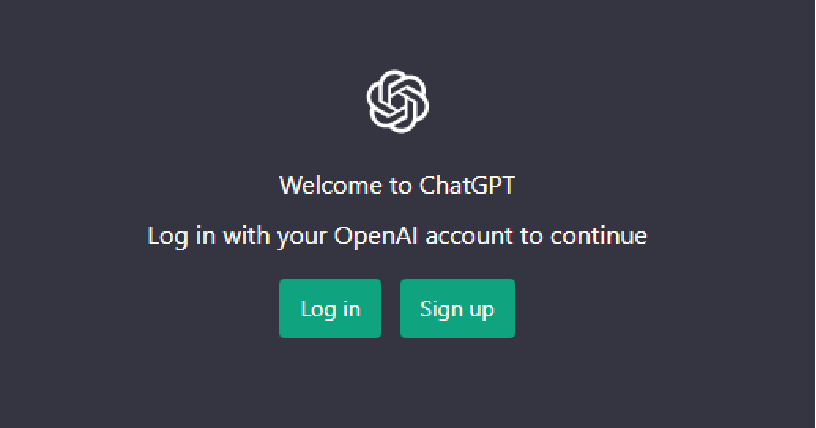
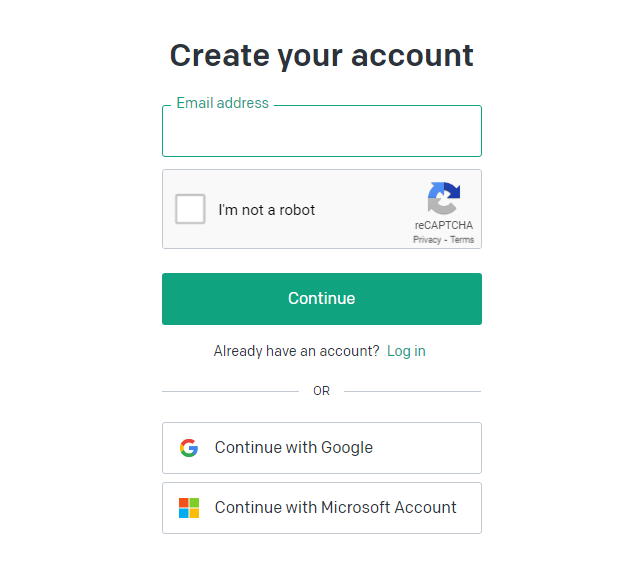
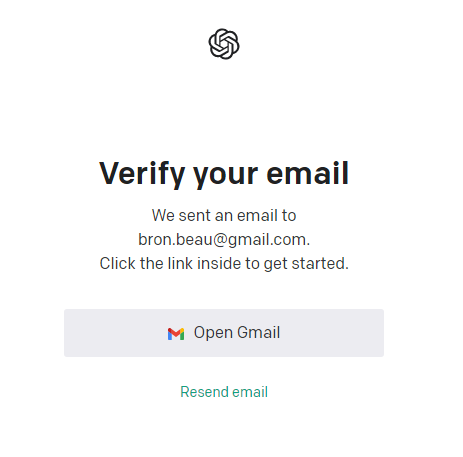
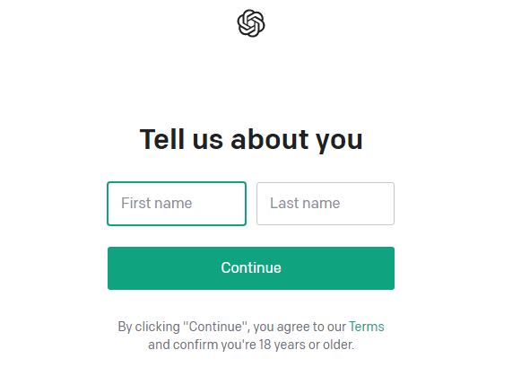
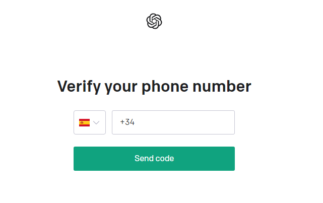
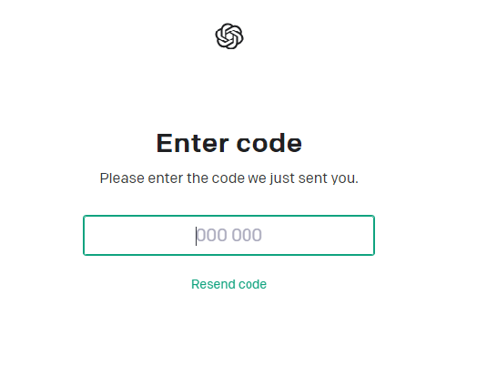
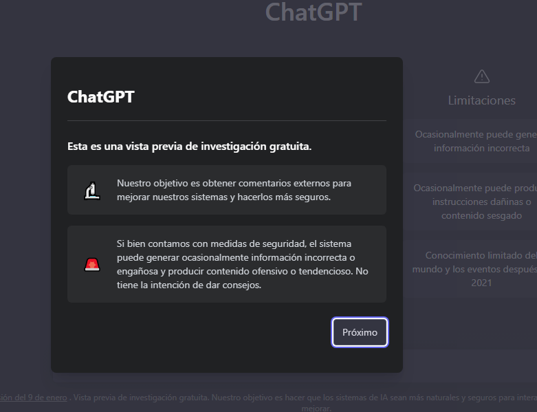
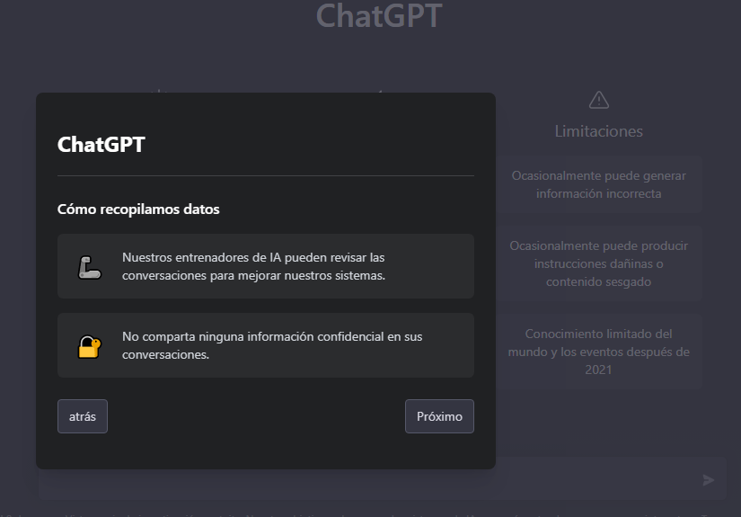
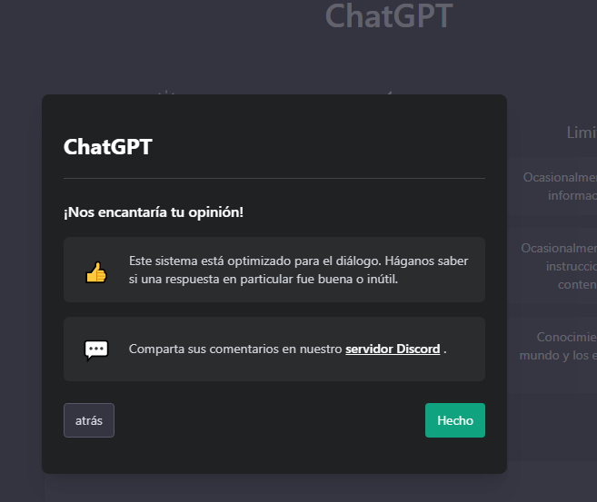
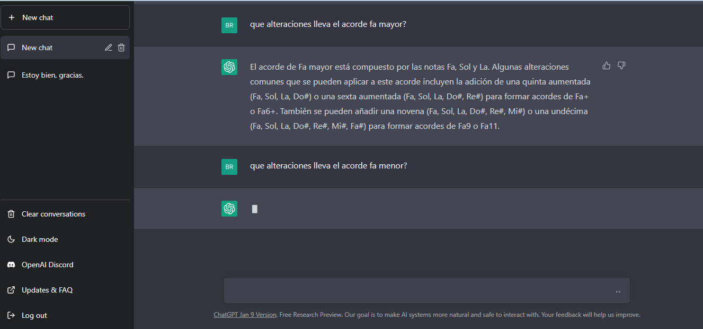

# chatGPT
___
  ChatGPT es un sistema de chat basado en el modelo de lenguaje por Inteligencia Artificial GPT-3, desarrollado por la empresa OpenAI. Es un modelo con más de 175 millones de parámetros, y entrenado con grandes cantidades de texto para realizar tareas relacionadas con el lenguaje, desde la traducción hasta la generación de texto.

* Para usarla se ingresa a el siguiente link: https://chat.openai.com

 

 Se tiene que crear una cuenta en openai con el correo electronico al que llegara un mail para verificarlo.

 
 

Luego se agregan algunos datos personales como nombre y telefono al que llegara un codigo de verificacion que se debe utilizar para completar el registro en open Ai.

 

Apareceran una serie de avisos a los que se debe clicar en el boton 'proximo' y 'hecho'

Una vez hecho esto se puede comenzar a interactuar con la IA a traves del chat.

___
Todo lo que escribas quedará registrado, y podrá ser revisado después por los desarrolladores de OpenIA para seguir entrenando a ChatGPT. 
___
